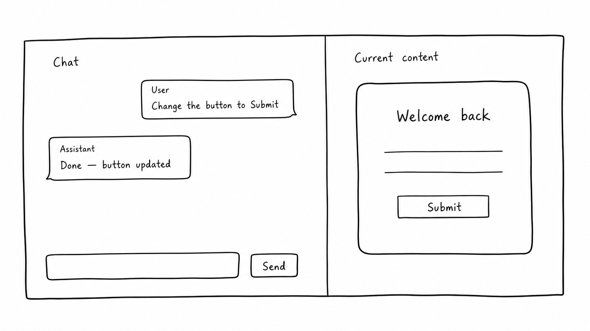

# Frontend task

Study the prepared repo and its contract in `README.md`. Then implement the transport layer and frontend with any tools or libraries.

The app must be able to:
- Load the current config and chat history.
- Provide a chat interface with ability to discuss config and change it, show tool activity and errors.
- Show a small read-only screen beside the chat with a title, body text, and a button label from the config.
- Update this screen only after the server confirms a successful change.

